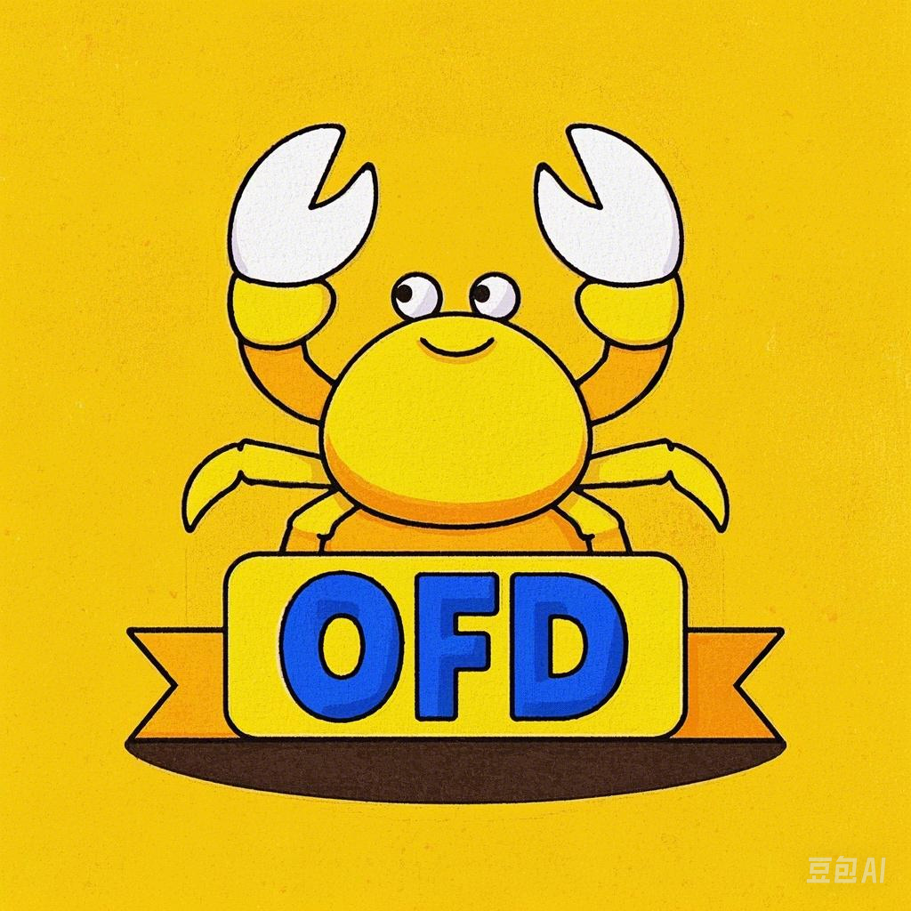

<p align="center"></p>

<p align="center">rofd </br> OFD parser and renderer library, in Rust.</p>
<p align="center"></p>


# Introduction

OFD (Open Form Document) is an open standard for electronic documents, which is widely used in China. Unlike PDF, which is a layout-based format, OFD is a semantic-based format, which means it stores the document structure and text information separately. This makes OFD documents more flexible and easier to edit than PDFs. OFD also supports more features than PDF, such as form filling and digital signatures.


# Plan

Current achivements:

- [x] learning
    - [x] Rust (basic syntax, types, traits, etc), notes [here](learning/notes.md)
    - [x] OFD spec (basic structure and elements)
- [x] parsing OFD files
    - [x] drawing text, images, simple paths
- [x] rendering to png
- [x] showing in a simple GUI application

Next steps: [TODOs.md](TODOs.md)


# Usage

To try it out, you can run the following command:

```bash
RUST_LOG=debug cargo run
```

# Logging

This library uses the `log` crate to record logs. To view log output, you need to initialize a logger implementation in your application. For example, using `env_logger`:


```rust
fn main() {
    // initialize logger
    env_logger::init();

    // your code...
    let mut ofd_node = read_ofd("learning/test.ofd").unwrap();
    export_ofd_to_png(&mut ofd_node, "target/out.png").unwrap();
}
```


# Project Strcuture

This project is organized into the following directories and files:

- `src/`: source code.
- `src/bin/rofd`: the rofd binary crate.
- `src/lib.rs`: the main library crate.
    - `src/document.rs`: document parsing and rendering.
    - `src/page.rs`: page parsing and rendering.
    - `src/render.rs`: rendering to Cairo surface.
    - `src/types.rs`: types used in OFD spec.
    - `src/elements.rs`: OFD elements.
    - `src/ofd.rs`: OFD file parsing.
- `learning/`: learning notes and examples.
- `resources/`: resources, such as the logo.
- `LICENSE`: license file.
- `Cargo.toml`: cargo configuration file.
- `README.md`: this readme file.


# Reference projects

- [ofdrw](https://github.com/ofdrw/ofdrw)
- [ofd-parser](https://github.com/jyh2012/ofd-parser)
- [poppler](https://gitlab.freedesktop.org/poppler/poppler)

# License

This project is under the terms of the [MIT License](https://github.com/rofd/rofd/blob/main/LICENSE).